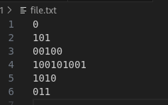
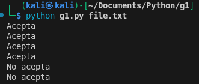

##  Descripción del código 

Este script en python y en c verifica si las cadenas de un archivo de texto corresponden a numeros capicuas (palíndromos) formados únicamente por `0` y `1`.

### Ejecucion
**Lectura del archivo**
   - El programa recibe como argumento la ruta de un archivo `.txt`.
   - Cada linea del archivo representa una cadena a evaluar.

**Verificación**
   - La función `es_capicua(cadena)` compara la cadena con su reverso (`cadena[::-1]`) y verifica que no esté vacía.
   - Si son identicas, la cadena es un palíndromo válido.

**Salida**
   - Imprime `Acepta` si la cadena cumple la gramática de palíndromos.
   - Imprime `No acepta` si no cumple.

### Ejemplo de uso
Input:

output:

