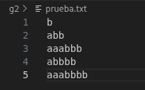
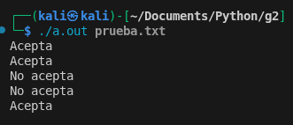

# Explicación del Código (Visión General)

## Función Principal
El programa analiza un archivo de texto que recibe como parámetro, verificando si cada línea cumple con las reglas del lenguaje G2.

**Parámetros de entrada:**
- Nombre de archivo (como argumento al ejecutar)

**Proceso:**
1. Abre el archivo especificado
2. Lee línea por línea
3. Para cada línea:
   - Elimina saltos de línea
   - Verifica si cumple el patrón G2
   - Imprime "Acepta" o "No acepta"

## Función `es_g2`
Verifica si una cadena cumple con el patrón del lenguaje G2.

**Lógica de validación:**
1. **Primera parte:** Debe comenzar con caracteres `a` o `0` (uno o más)
2. **Segunda parte:** El resto debe contener solo `b` o `1`
3. **Relación entre partes:** 
   - Si la primera parte tiene `n` caracteres
   - La segunda debe tener exactamente `n+1` caracteres

**Retorno:**
- `true` si cumple todas las reglas
- `false` si no las cumple

## Ejecucion
Input:

Output:

