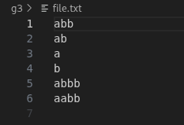
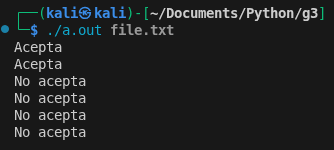

# Explicación del Código (

## Visión General
Este programa en Python verifica si las lineas de un archivo cumplen con las reglas del lenguaje G3, mostrando los resultados de validacion.

## Funcion `es_g3`
**Proposito**:  
Valida si una cadena cumple el patrón del lenguaje G3

**Lógica de validacion**:
1. **Primera parte**: Busca caracteres `'a'` o `'0'` al inicio
2. **Segunda parte**: Verifica que el resto sean solo `'b'` o `'1'`
3. **Relacion**: La segunda parte debe tener exactamente `n+1` caracteres 

**Retorno**:  
- `bool`: `True` si cumple el patrón, `False` si no

## Función `main`
**Flujo principal**:
1. Verifica que se proporcione un archivo como argumento
2. Abre el archivo en modo lectura
3. Procesa cada línea:
   - Elimina espacios y saltos de línea
   - Valida con `es_g3`
   - Imprime "Acepta" o "No acepta"

## Ejemplo de Uso
Input:

Output:

